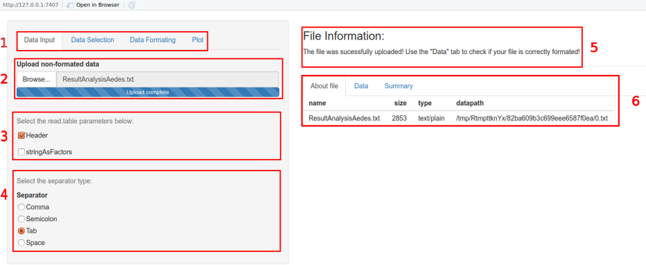
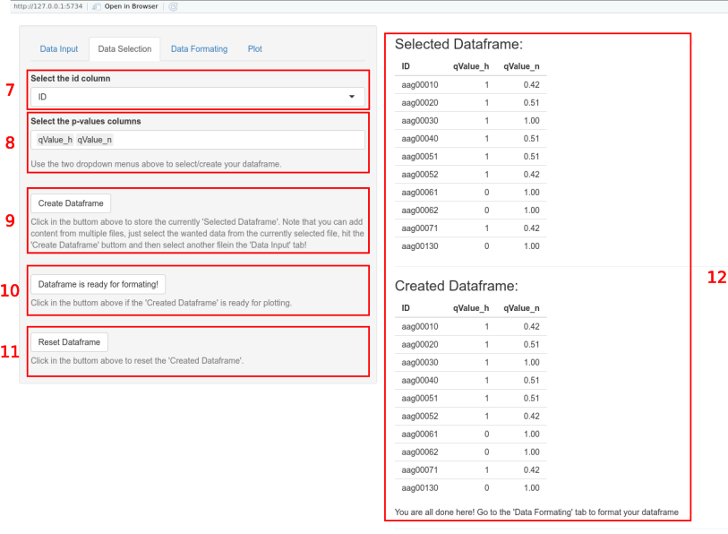
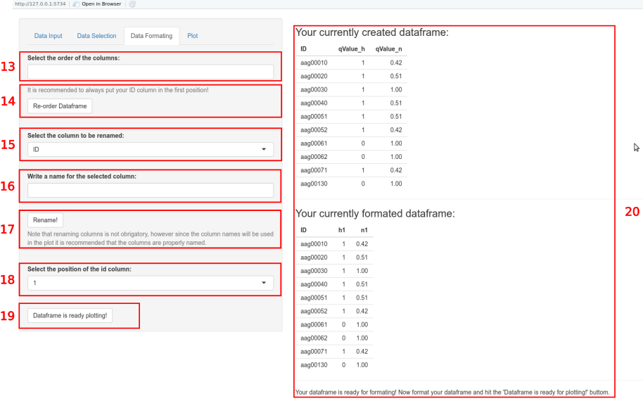
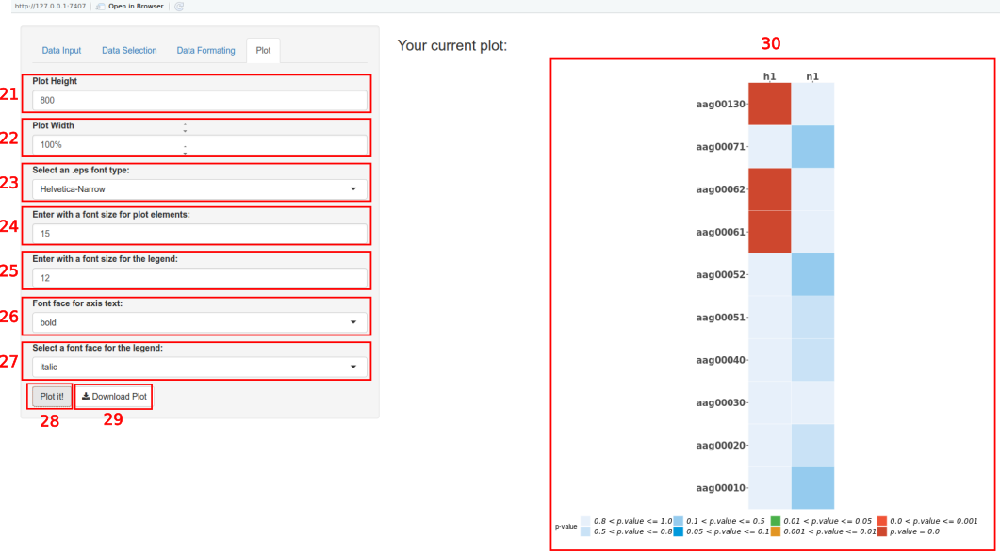
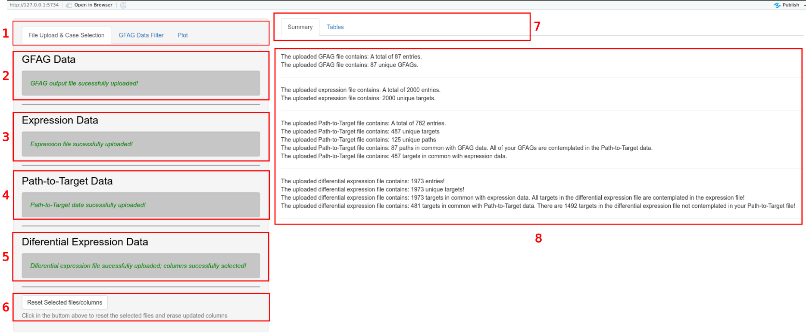
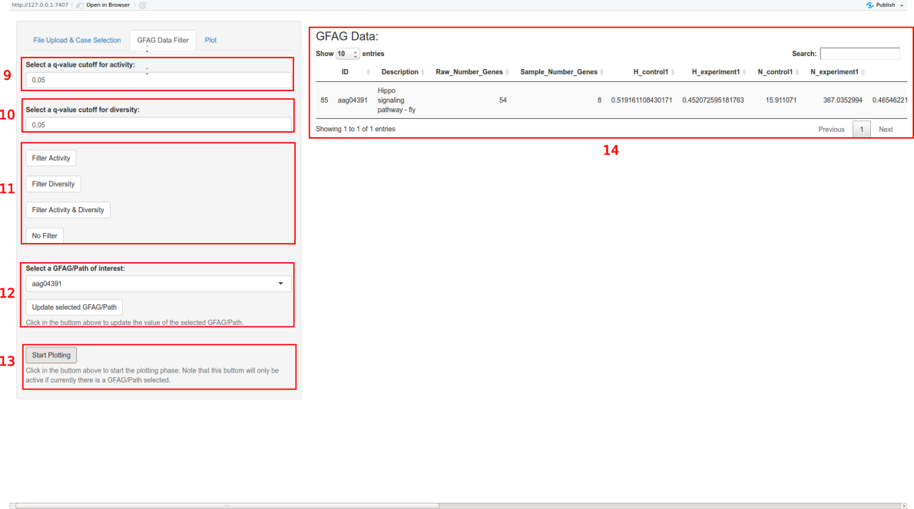
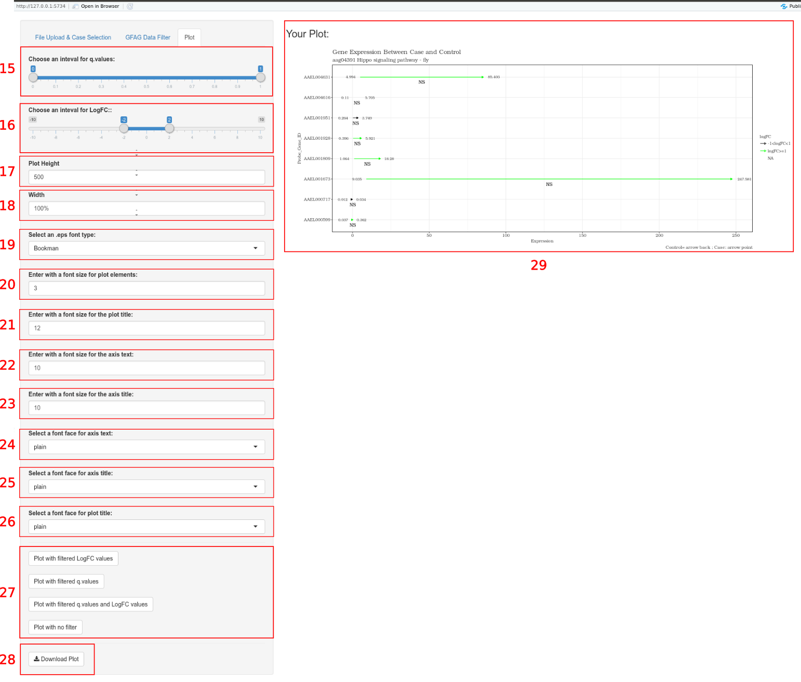

# Overview
*ADAMgui* is an Graphical User Interface  for the ADAM package which is
GSEA R package created to group a set of genes from comparative samples 
(control *versus* experiment) belonging to different species according to
their respective functions (Gene Ontology and KEGG pathways as default) 
and show their significance by calculating p-values referring to gene
diversity and activity (@Castro2009). Each group of genes is called GFAG 
(Group of Functionally Associated Genes). 

 The ADAM package was constituted by an 
statistical class, all genes present in the expression data are 
grouped by their respective functions according to the domains described by 
AnalysisDomain argument. The relationship between genes and functions are made
based on the species annotation package. If there is no annotation package, 
a three column file (gene, function and function description) must be provided.
For each GFAG, gene diversity and activity in each sample are calculated. As the
package allways compare two samples (control *versus* experiment), relative gene
diversity and activity for each GFAG are calculated. Using bootstrap method,
for each GFAG, according to relative gene diversity and activity, two p-values
are calculated. The p-values are then corrected, according to the correction
method defined by PCorrectionMethod argument, generating a q-value (@molan2018). 
The significative GFAGs will be those whoose q-value stay under the cutoff set
by PCorrection argument. Optionally, it's possible to run Wilcoxon test and/or 
Fisher's exact test (@fontoura2016). These tests also provide a corrected
p-value, and siginificative groups can be seen through them.

The ADAMgui package provides a graphical class so the outputs of the statistical 
functions in the ADAM package  can be studied through different plots. 
It's possible, for example, to choose a specific GFAG and observe the gene 
expression behavior within it. Features as differential expression and fold
change can be easily seen.

# Graphical User Interface (GUI)
The ADAMgui package contains 2 graphical modules for visualization and analysis of 
the GFAGAnalysis output file. These modules are shiny-generated (GUI)s that
allows the user to create and download plots in .eps format. The functions that
launches those applications are: GFAGpathUi() and GFAGtargetUi(). The sections
bellow contains more information about both applications.

## GFAG Path Viewer Function: GFAGpathUi()
'Paths' are essentially group names that contains the targets (eg: Gene
Ontologies and KEGG are paths while genes and proteins related to them 
are targets). The GFAGAnalysis output file contains information about the paths
that the user utilized in the analysis and the GFAGpathUi() is a function that
launches a shiny based (GUI) that can construct heatmaps for q-values present in
the GFAGAnalysis output file. Bellow there is the layout of an usage example of
the application with the GFAGAnalysis output file created with the first 10
entries of the *Aedes Aegypt* data used in the statistical modules. 

To generate the input file 'ResultAnalysisAedes.txt' use the commands on R 
console listed bellow. First load the data in the package:
```{r eval=TRUE, fig.height=6, fig.width=6}
library(ADAMgui)
data("ResultAnalysisAedes")
```

Then select the first 10 rows:
```{r eval=TRUE, fig.height=6, fig.width=6}
library(ADAMgui)
data("ResultAnalysisAedes")
dt<-ResultAnalysisAedes[1:10,]
```
And save it:
```{r eval=FALSE, fig.height=6, fig.width=6}
write.table(dt,'ResultAnalysisAedes.txt',sep='\t',quote = F,
    row.names = F,col.names = T)
```

Now launch the app, it can be launched in local machine or your default browser:
```{r eval=TRUE, fig.height=6, fig.width=6}
library(ADAMgui)
```

```{r eval=FALSE, fig.height=6, fig.width=6}
 GFAGpathUi(TRUE)  #Run the app in your default browser.
 GFAGpathUi(FALSE) #Run the app in R (your local machine).
```

<center>

*  <div style="text-align: justify"> **1** - **Tabs** </div>
    + <div style="text-align: justify"> **Data Input** - 
    The first and the only non-disabled Tab upon the application's launching. 
    As the name implies, it is where the user will choose the input
    data (GFAGAnalysis output file) and it's reading parameters. </div> 
    + <div style="text-align: justify"> **Data Selection** - The elements of
    this Tab will be disabled initially, you need to correctly upload a file in
    the first tab to enable it's elements. Here you will be able to select the 
    data to be plotted. </div>
    + <div style="text-align: justify"> **Data Formatting** - The elements of
    this Tab will be disabled initially, you need to correctly upload a file in
    the first tab and then select your data in the second Tab to enable its 
    elements. Here you will be able to format the selected data (select column
    order, rename columns, etc.). </div>
    + <div style="text-align: justify"> **Plot** - The elements of
    this Tab will be disabled initially, you need to correctly upload a file in
    the first tab, select your data in the second Tab and the format the 
    selected data in the third Tab to enable its elements. Here you will be 
    able to plot the data and download the plot in .eps format. </div>
* <div style="text-align: justify"> **2** - **Tab 1: File upload** - A search
buttom to upload the non-formated raw data (GFAGAnalysis output file) </div>
* <div style="text-align: justify"> **3** - **Tab 1: Read Table Parameters** -
Parameters for reading file uploaded in **2**, checks=TRUE. </div>
* <div style="text-align: justify"> **4** - **Tab 1: Read Table Separator** -
Separators for reading file uploaded in **2**, checks=TRUE (naturally only
one may be selected). </div>
* <div style="text-align: justify"> **5** - **Tab 1: File Information** -
Dinamic message in the main panel that informs the user about the progress in
the process of file uploading. </div>
* <div style="text-align: justify"> **6** - **Tab 1: Main Panel Tabs** - Tabs
in the main panel that only appear if a file was correctly uploaded. The '
About file' Tab provides basic information about the uploaded file such as 
name, size and path. The 'Data' Tab shows the created data.table according to
the uploaded file in **1** and the selected parameters in **3** and **4**. 
The 'Summary' Tab shows the output of the summary() function. </div>

<center>

* <div style="text-align: justify"> **7** - **Tab 2: Select the ID column** -
Select the ID (Path) column of the uploaded file. </div>
* <div style="text-align: justify"> **8** - 
**Tab 2: Select the P-values/Q-values columns** -
Select multiple columns corresponding to the p-values or q-values to be 
plotted. </div>
* <div style="text-align: justify"> **9** - **Tab 2: Create Dataframe** -
Action Buttom to create a data.frame with the selected columns in **7** and 
**8**. Note that you can add columns from multiple files, as long as the
ID column is IDENTICAL!</div>
* <div style="text-align: justify"> **10** -
**Tab 2: Dataframe is ready for plotting** - Action button to confirm the
creation of the data.frame. </div>
* <div style="text-align: justify"> **11** - **Tab 2: Reset Dataframe** -
Action buttom that resets everything done by the user in **Tabs 2,3 and 4**.
</div>
* <div style="text-align: justify"> **12** - **Tab 2: Main Panel** - 
Shows the selected data.frame and the created data.frame. </div>

<center>

*  <div style="text-align: justify"> **13** -
**Tab 3: Select Columns Order** - Select the desired column order of your
created data.frame, this will affect the plot.</div>

*  <div style="text-align: justify"> **14** -
**Tab 3: Re-order dataframe** - Action button that reorders the created 
data.frame according to the selected order in **13**. Should **13**
be empty the order will not be altered.</div>

*  <div style="text-align: justify"> **15** -
**Tab 3: Select a column to rename** - Disabled until you hit **14**,
this allows the user to select a column to be renamed. Note that renaming
columns is purely optional!.</div>

*  <div style="text-align: justify"> **16** -
**Tab 3: Write a name for the selected column** - Disabled until you hit **14**,
this allows the user to input a new name for the column selected in **15**.
Note that renaming columns is purely optional!.</div>

*  <div style="text-align: justify"> **17** -
**Tab 3: Rename Button** - Disabled until you hit 
**14**, this action button renames the column selected in **14** with the name
in **15**. If **15** is empty, the column in **14** will not be renamed.
Note that renaming columns is purely optional!.</div>

*  <div style="text-align: justify"> **18** -
**Tab 3: Select ID/Path column position** - Disabled until you hit **14**,
here you must select what is the current position of your ID/Path column
in your currently formated data.frame. The default value is 1, should your 
ID/Path column be in another position, then change the value accordingly!
</div>

*  <div style="text-align: justify"> **19** -
**Tab 3: Dataframe is ready for plotting** - Disabled until you hit **14**,
this action button informs the application that the formating process is 
finished. Upon hitting the plotting phase will start and the elements in 
Tab 4 will be enabled.
.</div>

*  <div style="text-align: justify"> **20** -
**Tab 3: Main Panel** - The main Panel will show the created data.frame in 
**Tab 2** initially, then it will also show the formated data.frame upon any
changes done by the user in **Tab 3**. The main panel also displays a dinamic 
message that informs the user about progress done in this Tab.
.</div>


<center>

*  <div style="text-align: justify"> **21** -
**Tab 4: Plot Height** - Select the desired height for the plot, 
it is a reactive input, meaning that the plot will be updated automatically
as this value changes.
.</div>

*  <div style="text-align: justify"> **22** -
**Tab 4: Plot Width** - Select the desired width for the plot, 
it is a reactive input, meaning that the plot will be updated automatically
as this value changes.
.</div>

*  <div style="text-align: justify"> **23** -
**Tab 4: Select a font family for plot elements** - Select the desired font 
family for the plot's elements. Not reactive, you need to click in **29** to 
re-plot and see the changes.
.</div>

*  <div style="text-align: justify"> **24** -
**Tab 4: Select a size for plot elements** - Select the desired size for the
font of the plot's elements. Not reactive, you need to click in **29** to 
re-plot and see the changes.
.</div>

*  <div style="text-align: justify"> **25** -
**Tab 4: Select a size for plot legend** - Select the desired size for the
font of the plot's legend. Not reactive, you need to click in **29** to 
re-plot and see the changes.
.</div>

*  <div style="text-align: justify"> **26** -
**Tab 4: Select a font face for the axis text** - Select the desired face
 (default='plain','bold','italic','bold.italic')  for the font of the 
 plot's legend. Not reactive, you need to click in **29** to re-plot and see
 the changes.</div>

*  <div style="text-align: justify"> **27** -
**Tab 4: Select a font face for the legend** - Select the desired face
 (default='plain','bold','italic','bold.italic') for the font of the plot's 
 legend. Not reactive, you need to click in **29** to re-plot and see the 
 changes.</div>
 
 *  <div style="text-align: justify"> **28** -
**Tab 4: Plot Button** - Action button to display the plot with the 
selected parameters.</div>

 *  <div style="text-align: justify"> **29** -
**Tab 4: Download Button** - Download buttom, downloads the displayed
plot in .eps format. Disabled as long as there is no plot displayed.</div>

 *  <div style="text-align: justify"> **30** -
**Tab 4: Main Panel** - Displays the plot.</div>

## GFAG Target Viewer Function: GFAGtargetUi()

This application was made to further analyse the GFAGs in the GFAGAnalysis
output file. These paths can have many targets (genes, proteins) and this
application constructs a plot that show the differential expression of the
targets in a selected Path. The user needs to input 4 files in order to use this
application: the GFAGAnalysis output file, an expression file, a Path-to-Target 
relationship file and a differential expression file.

Bellow there is the layout of an usage example of the application with the
GFAGAnalysis output file of the *Aedes Aegypt* data used in the
statistical modules. Load the required data first in order to generate
the input data:

```{r eval=TRUE, fig.height=6, fig.width=6}
library(ADAM)
```

```{r eval=TRUE, fig.height=6, fig.width=6}
data("ResultAnalysisAedes") # GFAG Output data
```

```{r eval=TRUE, fig.height=6, fig.width=6}
data("ExpressionAedes") # target expression data
```

```{r eval=TRUE, fig.height=6, fig.width=6}
data("GeneFunctionAedes") # Path-to-Target relationship data
```

```{r eval=TRUE, fig.height=6, fig.width=6}
data("DiffAedes") # target differential expression
```

Now create the files:

```{r eval=FALSE, fig.height=6, fig.width=6}

# save the GFAG output file
write.table(dt,'ResultAnalysisAedes.txt',sep='\t',quote = F,
    row.names = F,col.names = T)

# save the target expression file
write.table(dt,'ExpressionAedes.txt',sep='\t',quote = F,
    row.names = F,col.names = T)

# save the Path-to-Target relationship file
write.table(dt,'GeneFunctionAedes.txt',sep='\t',quote = F,
    row.names = F,col.names = T)

# save the target differential expression file
write.table(dt,'DiffAedes.txt',sep='\t',quote = F,
    row.names = F,col.names = T)
```

The app can be launched in local machine or your default browser:

```{r eval=TRUE, fig.height=6, fig.width=6}
library(ADAMgui)
```

```{r eval=FALSE, fig.height=6, fig.width=6}
GFAGtargetUi(TRUE)  #Run the app in your default browser.
GFAGtargetUi(FALSE) #Run the app in R (your local machine).
```

<center>

*  <div style="text-align: justify"> **1** - **Tabs** </div>
    + <div style="text-align: justify"> **File Upload & Case Selection** - 
    The first and the only non-disabled Tab upon the application's launching. 
    As the name implies, it is where the user will choose the input
    data (GFAGAnalysis output file) it's reading parameters. </div> 
    + <div style="text-align: justify"> **GFAG Data Filter** -
    The elements of this Tab will be disabled initially, you need to correctly
    upload a file in the first tab to enable it's elements. Here you will be
    able to filter and select the Paths whose targets will be plotted.</div>
    + <div style="text-align: justify"> **Plot** -
    The elements of this Tab will be disabled initially, you need to correctly
    upload a file in the first tab and select a GFAG in the second Tab to 
    enable it's elements. Here you will be able to select plotting parameters,
    construct the plot and download it in .eps format.</div>

*  <div style="text-align: justify"> **2** - 
**Tab 1: GFAG Data** Initially this the only enabled element. Is it
where the user will choose the GFAGAnalysis output file and consequentially
the case as well.</div>

*  <div style="text-align: justify"> **3** - 
**Tab 1: Target Expression Data** . This element is initially disabled, the user
needs to correctly upload a GFAGAnalysis output file first to enable it.
Here the user will choose the expression file that he used to generate the
GFAG output file that was selected.</div>

*  <div style="text-align: justify"> **4** - 
**Tab 1: Path-to-Target Data** . This element is initially disabled, the user
needs to correctly upload a GFAGAnalysis output file and a expression file 
first. Here the user will choose the Path-to-Target relationship file that can
be generated by the statistical modules.</div>

*  <div style="text-align: justify"> **5** - 
**Tab 1:Target Differential Expression Data** . This element is initially
disabled, the user needs to correctly upload a GFAGAnalysis output file, a 
expression file anda Path-to-Target file first. Here the user will choose the
differential expression file of interest. Note that this package does not 
supports differential expression analysis. The user needs to make the analysis 
by other means and input the results in the correct format. Because of this, 
once a file is uploaded a menu containing reading parameters and column
selection elements will be displayed in this field. The columns to be selected
are respectively: the column the contains the target's ID, the column that
contains the logFC (log Fold Change) values and a the column that contains the
p-values or q-values. No control can implemented here, so if the user input the
wrong columns in the fields, the resulting plot will be wrong. Should this
happen the user needs to reset the application by clicking on **6**.</div>

*  <div style="text-align: justify"> **6** - 
**Tab 1: Reset Button** . This action button can reset the whole application
so the user can make a new analysis.</div>

*  <div style="text-align: justify"> **7** - 
**Tab 1: Main Panel Tabs** .</div>
    + <div style="text-align: justify"> **7** - 
    **Tab 1: Main Panel Tab 1-Summary** Displays information about
    the uploaded files such as the number of entries in each file,
    the number of unique elements in each file, the number of targets
    that are present in your expression file that are contemplated
    in the Path-to-Target file, the number of Paths in your GFAGAnalysis output
    file that are contemplated in the Path-to-Target.</div>
    + <div style="text-align: justify"> **7** - 
    **Tab 1: Main Panel Tab 2-Tables** Displays data.tables of the uploaded
    files.</div>
    
*  <div style="text-align: justify"> **8** - 
**Tab 1: Main Panel** . Different displays depending on the selected Tab
in **7**.</div>


<center>

*  <div style="text-align: justify"> **9** - 
**Tab 2: Select q-value cut-off for ativity** - Input a desired q-value
cutoff for the ativity.</div>

*  <div style="text-align: justify"> **10** - 
**Tab 2: Select q-value cut-off for diversity** - Input a desired q-value
cutoff for the diversity.</div>

*  <div style="text-align: justify"> **11** - 
**Tab 2: Filter Buttons** - Action buttons for filtering the uploaded GFAG 
output file so the user can select a Path. There are 4 buttons: 'Filter 
Ativity', 'Filter Diversity', 'Filter Ativity and Diversity' and
'No Filter', respectively.</div>

*  <div style="text-align: justify"> **12** - 
**Tab 2: Select a Path of interest** - Select a path of interest and then
click on the 'Update GFAG/Path' action button to update the value.</div>

*  <div style="text-align: justify"> **13** - 
**Tab 2: Start Plot** - Click in the action button once a Path has been 
selected and updated in **12** to start the plotting phase and enable 
the elements in **Tab 3**</div>

*  <div style="text-align: justify"> **14** - 
**Tab 2: Main Panel** - Displays a data.table of the filtered GFAGAnalysis
output file.</div>

<center>

*  <div style="text-align: justify"> **15** - 
**Tab 3: Q-value interval selection** - Slider input to select a desired 
q-value interval between 0 and 1. Used for filtering q-values to plot.
</div>

*  <div style="text-align: justify"> **16** - 
**Tab 3: LogFC interval selection** - Slider input to select a desired 
logFC interval between -10 and 10. Used for filtering logFCs to plot.
</div>

*  <div style="text-align: justify"> **17** - 
**Tab 3: Plot Height** - Select the desired plot height.
</div>

*  <div style="text-align: justify"> **18** - 
**Tab 3: Plot Width** - Select the desired plot height.
</div>

*  <div style="text-align: justify"> **19** - 
**Tab 3: Select font family for plot elements** - Select the desired font family
for the plot's elements.
</div>


*  <div style="text-align: justify"> **20** - 
**Tab 3: Select font size for plot elements** - Select the desired font size
for the plot's elements.
</div>

*  <div style="text-align: justify"> **21** - 
**Tab 3: Select font size for plot title** - Select the desired font size
for the plot's title.
</div>

*  <div style="text-align: justify"> **22** - 
**Tab 3: Select font size for axis text** - Select the desired font size
for the axis text.
</div>

*  <div style="text-align: justify"> **23** - 
**Tab 3: Select font size for axis title** - Select the desired font size
for the axis title.
</div>

*  <div style="text-align: justify"> **24** - 
**Tab 3: Select font face for axis text** - Select the desired font face
for the axis text.
</div>

*  <div style="text-align: justify"> **25** - 
**Tab 3: Select font face for axis title** - Select the desired font face
for the axis title.
</div>

*  <div style="text-align: justify"> **26** - 
**Tab 3: Select font face for plot title** - Select the desired font face
for the plot title.
</div>

*  <div style="text-align: justify"> **27** - 
**Tab 3: Plot Buttons** - Buttons to create a plot with the selected data and 
parameters and display it on the main panel. There are 4 tipes of plots: 'Plot
with filtered LogFC values', 'Plot with filtered q.values', 'Plot with filtered
q.values and LogFC values' and 'Plot with no filter'.
</div>

*  <div style="text-align: justify"> **28** - 
**Tab 3: Download Plot** - Download buttom for downloading the displayed plot
in .eps format. Disabled as long as there is no plot displayed on the main 
panel.
</div>

*  <div style="text-align: justify"> **29** - 
**Tab 3: Main Panel** - Display the plot.
</div>

# References
